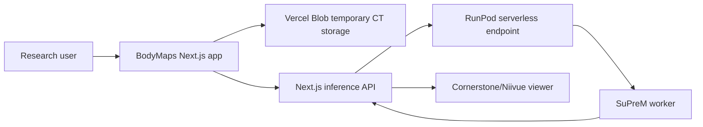

# BodyMaps

BodyMaps is an end-to-end CT organ segmentation and visualization application developed for the JHU CCVL Research Group. The web app uploads CT volumes, sends inference jobs to a RunPod GPU worker powered by SuPreM, and visualizes segmentation masks in an interactive medical imaging viewer.

## System Overview



## Repository Layout

```text
src/                         Next.js application and medical image viewer
workers/suprem-runpod/       RunPod GPU worker for SuPreM inference
packages/contracts/          Web/worker inference contract
docs/                        Architecture and migration notes
```

## Environment Variables

- `RUNPOD_ENDPOINT`: RunPod Serverless endpoint URL. Exclude trailing `/runsync`.
- `RUNPOD_ENDPOINT_KEY`: RunPod API key.
- `BLOB_READ_WRITE_TOKEN`: Vercel Blob token.
- `PASSWORD`: Basic research-access password for uploads.
- `DISABLE_PASSWORD`: Optional local-development bypass for `/api/process`.
- `NEXT_PUBLIC_ALLOW_SAMPLE_DATA`: Optional flag to enable bundled sample-data loading if sample files are present in `public/samples`.

## Web Development

```bash
npm install
npm run dev
```

## Worker Development

The internal inference worker lives in `workers/suprem-runpod`.

```bash
cd workers/suprem-runpod
./build.sh
```

The worker Dockerfile downloads the SuPreM checkpoint during image build. If checkpoints are committed to this repository, they must be tracked through Git LFS.

## Documentation

- `docs/architecture.md`: system architecture and request flow
- `docs/model.md`: SuPreM model behavior, supported organs, and metrics
- `docs/deployment.md`: Vercel and RunPod deployment notes
- `docs/security.md`: research-use and data-handling notes
- `docs/evidence/README.md`: captured RunPod and local viewer proof assets

## Evidence Assets

Captured proof-of-work screenshots and a short interaction recording are stored in `docs/evidence`. The local sample viewer can be opened at `/visualization?sample=1` when `NEXT_PUBLIC_ALLOW_SAMPLE_DATA=1` is enabled.


Interaction recording: [`docs/evidence/bodymaps-viewer-interaction.mov`](docs/evidence/bodymaps-viewer-interaction.mov)

## Inference Contract

The web app and worker communicate through the contract documented in `packages/contracts/inference.schema.json`. Worker responses contain one entry per organ, with:

- `content`: base64-encoded `.nii.gz` segmentation mask
- `volume_cm`: organ volume in cubic centimeters, or a status string
- `mean_hu`: mean Hounsfield unit value, or a status string

## Research Use Notice

BodyMaps is built for research workflows in the JHU CCVL Research Group. It is not a clinical diagnostic system. Avoid uploading protected health information unless the surrounding deployment, storage, access control, and compliance posture have been reviewed for that use.
