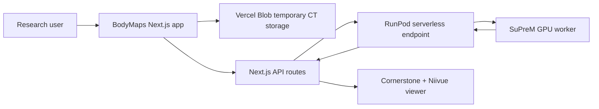
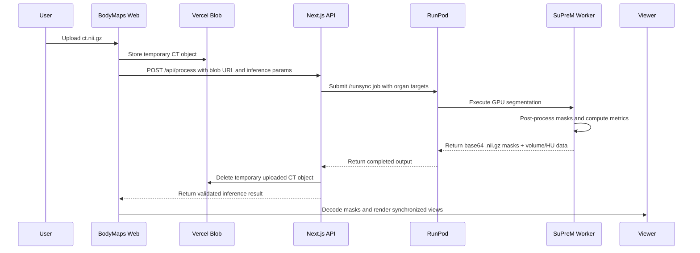
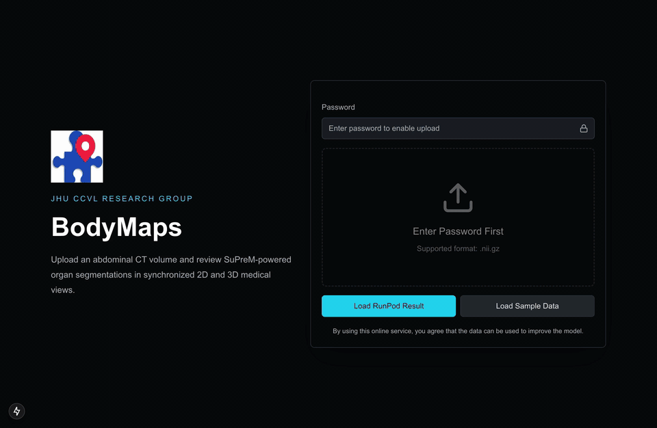

<div align="center">
  <h1>BodyMaps</h1>
  <p><strong>CT organ segmentation and visualization for the JHU CCVL Research Group</strong></p>
  <p>Next.js research interface &middot; RunPod SuPreM worker &middot; Cornerstone/Niivue medical viewer</p>
  <p>
    <a href="https://ccvl.jhu.edu/">JHU CCVL Research Group</a> &middot;
    <a href="docs/evidence/app-flow/README.md">UI flow</a> &middot;
    <a href="docs/evidence/app-flow/bodymaps-runpod-visualization.mp4">app demo recording</a>
  </p>
</div>

---

## About

BodyMaps is an end-to-end CT organ segmentation and visualization system built for the [JHU CCVL Research Group](https://ccvl.jhu.edu/). It combines a Next.js research interface, password-gated CT intake, temporary blob storage, a typed inference API, and a Dockerized SuPreM worker running on RunPod GPU infrastructure.

Given a `.nii.gz` CT volume, BodyMaps routes the scan through SuPreM inference, returns per-organ NIfTI segmentation masks with quantitative measurements, and renders the result in synchronized 2D and 3D medical imaging views.

At a glance:

- Next.js 15 app for CT upload, inference orchestration, and browser-based review.
- Vercel Blob-backed upload pipeline with password checks and post-inference cleanup.
- RunPod serverless worker packaging SuPreM, PyTorch CUDA, MONAI, nibabel, and scipy in Docker.
- React Context-based viewer state shared across Cornerstone 2D planes and Niivue 3D rendering.
- Zod and JSON Schema contracts for validating web/worker inference payloads.

## System Overview





## Application Layers

BodyMaps is organized around the path a CT volume takes through the system: upload, temporary storage, inference, result validation, and interactive review.

| Layer | How it works |
| --- | --- |
| Research interface | The web app provides CT upload, local evidence loading for verification, organ visibility controls, segmentation opacity, CT window/level adjustment, metric review, and viewport inspection. |
| Inference API | The Next.js API validates request parameters with Zod, submits RunPod `/runsync` jobs, polls queued requests when needed, serializes worker output safely for the browser, and removes temporary Vercel Blob uploads after processing. |
| GPU worker | The RunPod serverless handler downloads the CT input, applies SuPreM preprocessing parameters, runs MONAI sliding-window inference on CUDA, post-processes organ masks, and returns viewer-ready NIfTI segmentations. |
| Viewer state | Shared React context keeps the CT volume URL, decoded masks, organ visibility, opacity, window, and level synchronized across Cornerstone 2D planes and the Niivue 3D view. |
| Contract boundary | `packages/contracts/inference.schema.json` and `src/utils/inference.ts` define the organ keys and response shape used between the web app and worker. |
| Deployment boundary | The web app and GPU worker are separated so the browser-facing product can remain lightweight while inference runs on RunPod-managed GPU capacity. |
| Measurements | For each organ, the worker returns a `.nii.gz` mask, volume in cubic centimeters when the organ is complete in the field of view, and mean HU after mask erosion to reduce boundary effects. |

## Demo Preview

The preview below is an app-only capture from the BodyMaps flow using a real RunPod inference result loaded into the viewer.



You can find the [app demo recording](docs/evidence/app-flow/bodymaps-runpod-visualization.mp4) and [UI flow page](docs/evidence/app-flow/README.md) here.

## ML Workflow

The inference backend lives in `workers/suprem-runpod`. It is packaged as a Docker image for RunPod and exposes a single job handler around the SuPreM model.


1. **Stage the scan.** Validate the RunPod payload, download the CT volume into a temporary case folder, and normalize spacing, windowing, ROI, and target-organ parameters.
2. **Run SuPreM inference.** Build the MONAI/nibabel loader, reuse the startup-loaded `Universal_model`, and run `sliding_window_inference` on CUDA.
3. **Recover organ masks.** Threshold predictions, run organ post-processing, and invert transforms back into NIfTI image space.
4. **Attach measurements.** Compute `volume_cm` when the organ is complete in the scan field of view and compute eroded-mask `mean_hu`.
5. **Return viewer-ready output.** Base64 encode each organ-specific `.nii.gz` mask and return the schema consumed by `src/utils/inference.ts`.

<details>
<summary><strong>Worker runtime notes</strong></summary>

- Docker image includes CUDA-compatible PyTorch, MONAI, nibabel, scipy, OpenCV, and RunPod runtime dependencies.
- The SuPreM checkpoint is downloaded during image build, then loaded once at worker startup.
- Each request can target selected organs instead of forcing one monolithic all-organ response.

</details>

Supported targets:

```text
spleen, kidney_right, kidney_left, gall_bladder, liver,
stomach, aorta, postcava, pancreas
```

## Repository Layout

```text
src/
  app/                         Next.js pages and API routes
  components/                  Upload, visualization, controls, modal, viewer panes
  context/                     Shared Cornerstone/Niivue segmentation state
  utils/                       Inference parsing, NIfTI decoding, sample/evidence loaders

workers/suprem-runpod/
  Dockerfile                   RunPod worker image
  src/handler.py               Serverless SuPreM inference handler
  src/model/                   SuPreM model backbones
  src/dataset/                 CT preprocessing and data loading
  src/pretrained_checkpoints/  Checkpoint placeholder and notes

packages/contracts/
  inference.schema.json        Web/worker response contract

docs/
  architecture.md              System and request-flow details
  model.md                     SuPreM model behavior and supported organs
  deployment.md                Vercel and RunPod deployment notes
  security.md                  Research-use and data-handling notes
  evidence/                    App-only proof-of-work captures
```

## Configuration

| Variable | Purpose |
| --- | --- |
| `RUNPOD_ENDPOINT` | RunPod Serverless endpoint base URL. Exclude the trailing `/runsync`. |
| `RUNPOD_ENDPOINT_KEY` | RunPod API key used by the Next.js API route. |
| `BLOB_READ_WRITE_TOKEN` | Vercel Blob token for temporary CT upload storage. |
| `PASSWORD` | Upload/process password for research access control. |
| `DISABLE_PASSWORD` | Optional local-development bypass for upload/process routes. |
| `NEXT_PUBLIC_ALLOW_SAMPLE_DATA` | Enables bundled sample/evidence loading for local verification. |

## Worker Development

The internal inference worker lives in `workers/suprem-runpod`.

```bash
cd workers/suprem-runpod
./build.sh
```

The Dockerfile downloads `supervised_suprem_unet_2100.pth` during image build. If checkpoints are committed to this repository, they must be tracked through Git LFS.

After deploying the worker image to RunPod, the smoke test validates the web/worker contract:

```bash
RUNPOD_ENDPOINT=... \
RUNPOD_ENDPOINT_KEY=... \
BODYMAPS_TEST_CT_URL=https://example.com/path/to/ct.nii.gz \
python3 scripts/runpod_smoke_test.py
```

## Inference Contract

The worker returns one object per organ:

```json
{
  "liver": {
    "content": "<base64-encoded .nii.gz mask>",
    "volume_cm": 1182.42,
    "mean_hu": 63.7
  }
}
```

Each organ payload contains:

- `content`: base64-encoded `.nii.gz` segmentation mask.
- `volume_cm`: organ volume in cubic centimeters, or a status string such as `Incomplete organ` or `N/A`.
- `mean_hu`: mean Hounsfield unit value, or `N/A`.

## Documentation

- `docs/architecture.md`: system architecture and request flow.
- `docs/model.md`: SuPreM model behavior, supported organs, and measurements.
- `docs/deployment.md`: Vercel, RunPod, Docker, and smoke-test notes.
- `docs/security.md`: research-use and data-handling posture.
- `docs/evidence/README.md`: captured UI flow evidence.

## Research Use Notice

BodyMaps is built for research workflows in the [JHU CCVL Research Group](https://ccvl.jhu.edu/). It is not a clinical diagnostic system. Avoid uploading protected health information unless the surrounding deployment, storage, access control, and compliance posture have been reviewed for that use.
