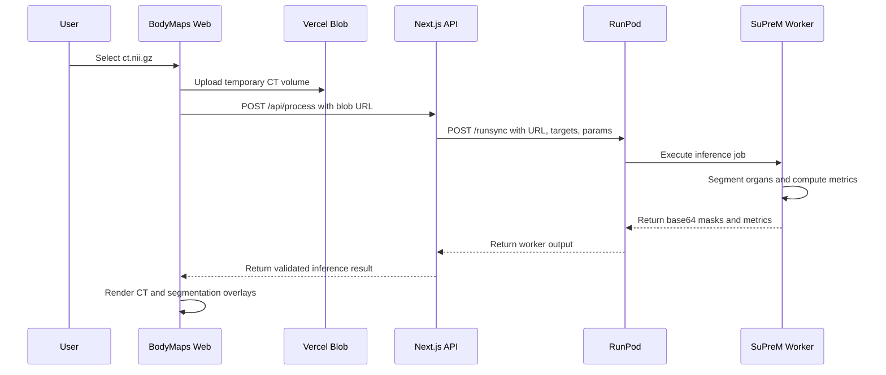

# BodyMaps Architecture

BodyMaps is split into a user-facing web app and a GPU inference worker.

## Components

- `src/`: Next.js app, upload flow, API routes, and CT visualization.
- `workers/suprem-runpod/`: RunPod worker that runs SuPreM inference.
- `packages/contracts/`: Schema for the worker response consumed by the web viewer.

## Request Flow

## Viewer Flow

The web app keeps the original CT volume URL and decoded segmentation masks in `CornerstoneContext`. The visualization page renders three orthographic CT views through Cornerstone and one 3D canvas through Niivue. Controls update segmentation visibility, opacity, and CT window/level.

## Contract Boundary

The worker returns one object per organ. The web app validates this shape with `src/utils/inference.ts` before converting base64 masks into `ArrayBuffer` values for the viewer.
