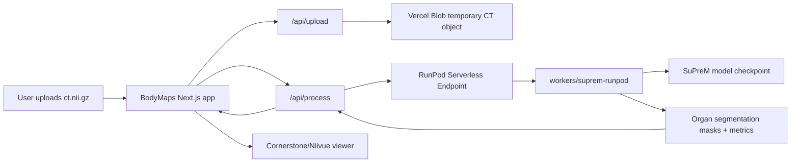

# BodyMaps + SuPreM Unification Implementation Plan

## 1. Goal

Make `BodyMaps` the final product repository and absorb the useful parts of `legacy SuPreM repository` as an internal inference backend module.

The unified repository should show both:

- Product-level technical depth: upload flow, authentication gate, inference orchestration, interactive CT viewer, segmentation overlays, window/level controls, and segmentation metrics display.
- ML/inference backend depth: RunPod worker, SuPreM model loading, MONAI sliding-window inference, organ post-processing, volume calculation, mean HU calculation, and Docker-based GPU deployment.

The end state should not feel like two prototype repositories pasted together. It should feel like one coherent end-to-end medical AI research application.

## 2. Current Repo Roles

### `BodyMaps`

`BodyMaps` is the final user-facing app candidate.

Current strengths:

- Next.js app already focused on BodyMaps branding.
- Upload flow sends CT files to Vercel Blob.
- API route calls a RunPod `/runsync` endpoint.
- Viewer renders CT volumes and segmentation masks with Cornerstone and Niivue.
- Supports segmentation visibility, opacity, window/level controls, fullscreen panel toggles, and segmentation data display.

Current limitations:

- It depends on `legacy SuPreM repository/runpod-worker` externally.
- Worker contract is implicit, not documented as a stable API.
- The README explains environment variables but does not fully explain architecture, model behavior, deployment, or data flow.
- Security posture is prototype-grade: password gate plus public temporary blob.

### `legacy SuPreM repository`

`legacy SuPreM repository` should be treated as the inference/backend origin.

Current strengths:

- Contains the RunPod worker that loads the SuPreM model checkpoint.
- Worker handles CT download, preprocessing, inference, organ post-processing, NIfTI segmentation output, volume, and mean HU.
- Dockerfile and build script already exist.

Current limitations:

- Its `nextjs/` app is a legacy prototype and overlaps with `BodyMaps`.
- The web side is less polished and has debugging/prototype traces.
- The useful long-term asset is the `runpod-worker/` directory, not the old `nextjs/` frontend.

## 3. Recommended Target Structure

Use `BodyMaps` as the destination repo. Move toward a monorepo layout:

```text
bodymaps/
  apps/
    web/
      src/
      public/
      package.json
      next.config.ts
      tailwind.config.ts
      tsconfig.json
  workers/
    suprem-runpod/
      Dockerfile
      build.sh
      input.example.json
      README.md
      src/
        handler.py
        model/
        dataset/
        utils/
        pretrained_checkpoints/
  docs/
    architecture.md
    deployment.md
    model.md
    security.md
    bodymaps_suprem_unification_plan.md
  packages/
    contracts/
      inference.schema.json
      README.md
  README.md
  .env.example
  .gitattributes
  .gitignore
```

### Why this structure

- `apps/web` clearly owns the final BodyMaps product experience.
- `workers/suprem-runpod` clearly owns GPU inference.
- `packages/contracts` prevents silent API drift between the web app and worker.
- `docs` turns the project into a portfolio-ready, explainable system rather than a raw prototype.

### Lower-risk alternative

If preserving Vercel configuration is more important than clean monorepo structure, keep the Next.js app at repo root initially and only add:

```text
workers/suprem-runpod/
docs/
packages/contracts/
```

Then move the web app to `apps/web` in a second phase. This reduces deployment breakage risk.

## 4. Target Architecture



## 5. Inference Contract

The first implementation priority is to make the web-to-worker interface explicit.

### Request shape

The web API should send:

```json
{
  "input": {
    "url": "https://...",
    "targets": [
      "spleen",
      "kidney_right",
      "kidney_left",
      "gall_bladder",
      "liver",
      "stomach",
      "aorta",
      "postcava",
      "pancreas"
    ],
    "space_x": 1.5,
    "space_y": 1.5,
    "space_z": 1.5,
    "a_min": -175,
    "a_max": 250,
    "b_min": 0,
    "b_max": 1,
    "roi_x": 96,
    "roi_y": 96,
    "roi_z": 96,
    "num_samples": 1
  }
}
```

### Response shape

The worker should return:

```json
{
  "spleen": {
    "content": "base64-encoded nii.gz segmentation",
    "volume_cm": 123.45,
    "mean_hu": 42.1
  },
  "aorta": {
    "content": "base64-encoded nii.gz segmentation",
    "volume_cm": "N/A",
    "mean_hu": 50.2
  }
}
```

### Contract tasks

- Add `packages/contracts/inference.schema.json`.
- Add a TypeScript helper in the web app that validates the RunPod response before viewer state is updated.
- Add a Python validation helper or lightweight assertions in the worker so invalid target names and missing URLs fail clearly.
- Document which organs are supported and why aorta/postcava volume may be `N/A`.

## 6. Migration Phases

### Phase 0: Preparation

Purpose: create a safe migration lane.

Tasks:

- Create a working branch, for example `unify-suprem-worker`.
- Confirm both repos are clean before moving files.
- Decide whether the final repo name remains `BodyMaps` or becomes a cleaner `bodymaps`.
- Decide whether to preserve commit history from `legacy SuPreM repository`.

Recommended decision:

- Use `BodyMaps` as the destination repo.
- Do not import all `legacy SuPreM repository` history unless required. The old repo can remain as historical origin.
- Mention in README that the worker was adapted from the prior `legacy SuPreM repository` prototype.

Deliverable:

- Clean branch ready for migration.

### Phase 1: Absorb the RunPod Worker

Purpose: bring ML/inference backend depth into the BodyMaps repo.

Tasks:

- Copy `legacy SuPreM repository/runpod-worker` into `BodyMaps/workers/suprem-runpod`.
- Rename `input.json` to `input.example.json`.
- Keep `Dockerfile`, `build.sh`, `src/handler.py`, `src/model`, `src/dataset`, and `src/utils`.
- Add worker-specific `README.md`.
- Add `.gitattributes` rules for `*.pth` if model weights remain in Git LFS.
- Decide checkpoint strategy:
  - Option A: keep `.pth` in Git LFS.
  - Option B: remove `.pth` from repo and download during Docker build.
  - Option C: mount/download model checkpoint in RunPod environment.

Recommended decision:

- For portfolio clarity, do not silently commit a 222 MB checkpoint as normal Git content.
- Use Git LFS if the checkpoint must live in the repo.
- Prefer a documented download step or Docker build argument if reproducibility matters more than repo size.

Deliverable:

- `workers/suprem-runpod` builds as the same worker currently used by BodyMaps.

### Phase 2: Stabilize the Worker

Purpose: make the backend look intentional rather than copied research code.

Tasks:

- Rename ambiguous files and comments where useful, without changing model behavior.
- Add clear constants for supported organs.
- Add request parsing validation:
  - missing `url`
  - empty `targets`
  - unsupported target
  - invalid numeric params
- Add response metadata fields if useful:
  - `model`
  - `checkpoint`
  - `targets`
  - `processing_time_seconds`
- Keep the current organ response shape unless the web app is updated at the same time.
- Move hard-coded defaults into a small config section near the top of `handler.py`.
- Make temporary directory cleanup robust with `with tempfile.TemporaryDirectory() as workdir`.

Deliverable:

- Worker has a documented, stable input/output contract and cleaner runtime failure modes.

### Phase 3: Connect Web App to Internal Worker Contract

Purpose: make the BodyMaps web app talk to a documented internal backend module.

Tasks:

- Keep using `RUNPOD_ENDPOINT` and `RUNPOD_ENDPOINT_KEY` for deployed inference.
- Rename API helper concepts from generic `process` to inference-specific naming internally, while preserving route compatibility if desired.
- Add shared constants for supported organs.
- Validate RunPod output before calling `setSegmentations`.
- Improve error messages:
  - invalid password
  - upload failed
  - inference timeout
  - worker returned malformed response
  - unsupported CT file
- Keep blob cleanup in `finally`.
- Confirm all worker targets expected by BodyMaps match `ORGAN_NAME_TO_INDEX` in the worker.

Deliverable:

- Web app depends on a clear `InferenceResult` contract instead of assuming arbitrary JSON.

### Phase 4: Repo Layout Cleanup

Purpose: make the repository read like a serious full-stack project.

Preferred tasks:

- Move current root web app files into `apps/web`.
- Update imports if path aliases change.
- Update `package.json`, `tsconfig.json`, Tailwind config, and Next config location.
- Update Vercel deployment root to `apps/web`.
- Add root-level README and scripts.

Example root `package.json` scripts:

```json
{
  "scripts": {
    "web:dev": "npm --prefix apps/web run dev",
    "web:build": "npm --prefix apps/web run build",
    "web:lint": "npm --prefix apps/web run lint",
    "worker:build": "cd workers/suprem-runpod && ./build.sh"
  }
}
```

Lower-risk tasks:

- Keep web app at root temporarily.
- Add `workers/`, `docs/`, and `packages/`.
- Move to `apps/web` only after the worker absorption is verified.

Recommended decision:

- Use the lower-risk layout first if the current Vercel deployment must stay stable.
- Move to `apps/web` once the project is already working with the internal worker.

Deliverable:

- Repo structure communicates final product plus backend module clearly.

### Phase 5: Documentation Upgrade

Purpose: make the project easy to understand and strong in a portfolio/review setting.

Docs to add:

- `README.md`
  - one-paragraph product summary
  - architecture diagram
  - feature list
  - local web setup
  - worker build/deploy setup
  - environment variables
  - research-use limitations
- `docs/architecture.md`
  - upload -> blob -> RunPod -> viewer flow
  - request/response schemas
  - sequence diagram
- `docs/model.md`
  - SuPreM model source
  - supported organs
  - checkpoint strategy
  - output metrics
- `docs/deployment.md`
  - Vercel deployment
  - Vercel Blob
  - RunPod worker Docker image
  - endpoint env vars
- `docs/security.md`
  - prototype-grade password gate
  - public temporary blob risk
  - PHI warning
  - recommended production hardening

Deliverable:

- A reviewer can understand the full system without reading every source file.

### Phase 6: Quality and Verification

Purpose: avoid breaking the existing BodyMaps app while absorbing the worker.

Web checks:

- `npm install`
- `npm run lint`
- `npm run build`
- Manual upload path with a known `.nii.gz` file
- Sample data path if `NEXT_PUBLIC_ALLOW_SAMPLE_DATA` is used
- Visualization page loads with all four panels
- Segmentation toggles work
- Opacity slider works
- Window/level controls work
- Segmentation data modal displays volume and mean HU

Worker checks:

- Docker image builds.
- Worker starts and loads model.
- Worker rejects invalid target names.
- Worker rejects missing URL.
- Worker processes a small known CT sample.
- Worker returns base64 `.nii.gz` content per organ.
- Worker returns `volume_cm` and `mean_hu` where expected.

Integration checks:

- Web app can call deployed RunPod endpoint.
- API route handles worker errors gracefully.
- Blob is deleted after processing.
- Malformed worker response does not crash viewer state.
- Large files over configured max size are rejected.

Deliverable:

- A short verification log in the PR or release notes.

### Phase 7: Polish for Product-Level Depth

Purpose: make the final app feel more complete than a research application.

Potential improvements:

- Replace generic progress simulation with actual job state if RunPod async mode is adopted.
- Add request ID / job ID display for debugging.
- Add organ color legend to viewer.
- Add export/download options for segmentation masks.
- Add a sample CT data mode that does not require uploading sensitive data.
- Add better empty/error states.
- Add a basic privacy warning before upload.
- Add image/window presets for CT viewing.

Deliverable:

- BodyMaps reads as a finished end-to-end medical imaging AI application.

## 7. Files to Bring From `legacy SuPreM repository`

Bring:

- `runpod-worker/Dockerfile`
- `runpod-worker/build.sh`
- `runpod-worker/input.json`, renamed to `input.example.json`
- `runpod-worker/src/handler.py`
- `runpod-worker/src/model/`
- `runpod-worker/src/dataset/`
- `runpod-worker/src/utils/`
- `runpod-worker/src/pretrained_checkpoints/README.md`
- checkpoint file only if using Git LFS or an explicit checkpoint-in-repo strategy

Do not bring by default:

- `nextjs/`
- old SuPreM web UI components
- old prototype README as the main README
- duplicate package locks from the old frontend

## 8. Main Risks

### Risk: checkpoint handling bloats or breaks the repo

Mitigation:

- Use Git LFS or Docker-time download.
- Document exact checkpoint source and expected filename.

### Risk: Vercel deployment breaks after monorepo move

Mitigation:

- First absorb worker without moving web app.
- Move to `apps/web` only after worker integration is stable.
- Update Vercel Root Directory and build command in one dedicated step.

### Risk: worker response format changes and viewer breaks

Mitigation:

- Add a shared inference schema.
- Validate response before updating viewer state.

### Risk: prototype implies production medical safety

Mitigation:

- Add clear README and UI language that this is a research prototype.
- Add `docs/security.md`.
- Avoid PHI claims unless real compliance work is done.

### Risk: public blob upload is inappropriate for sensitive data

Mitigation:

- Keep explicit warning.
- Delete blob after processing.
- For production, move to private object storage with signed URLs and stronger auth.

## 9. Suggested Commit Breakdown

1. `docs: add BodyMaps SuPreM unification plan`
2. `chore: add worker directory and checkpoint handling rules`
3. `docs: document RunPod worker setup`
4. `feat(worker): stabilize SuPreM inference contract`
5. `feat(web): validate inference responses`
6. `docs: add architecture and deployment guides`
7. `chore: move web app into apps/web` if choosing monorepo
8. `test: add worker and web verification notes`

This breakdown keeps review manageable and makes it easy to revert a specific migration step.

## 10. Definition of Done

The unification is complete when:

- The final repository contains both the BodyMaps web app and SuPreM RunPod worker.
- The old `legacy SuPreM repository/nextjs` prototype is not duplicated into the final app.
- The web app can process a CT through the internal worker contract.
- The viewer displays original CT plus segmentation masks.
- The worker build/deploy process is documented.
- The README clearly explains the end-to-end system.
- The model checkpoint strategy is explicit.
- A reviewer can understand the product and backend depth from the repo alone.

## 11. Recommended First Implementation Slice

Start with the smallest slice that proves the direction:

1. Add `workers/suprem-runpod` by copying only `legacy SuPreM repository/runpod-worker`.
2. Add worker README and checkpoint handling note.
3. Add `packages/contracts/inference.schema.json`.
4. Update BodyMaps README to describe the internal worker instead of linking to an external repo.
5. Do not move the web app to `apps/web` yet.
6. Run web build/lint.
7. Build the worker Docker image if the local environment supports it.

After that slice works, proceed to monorepo layout cleanup and deeper polish.
