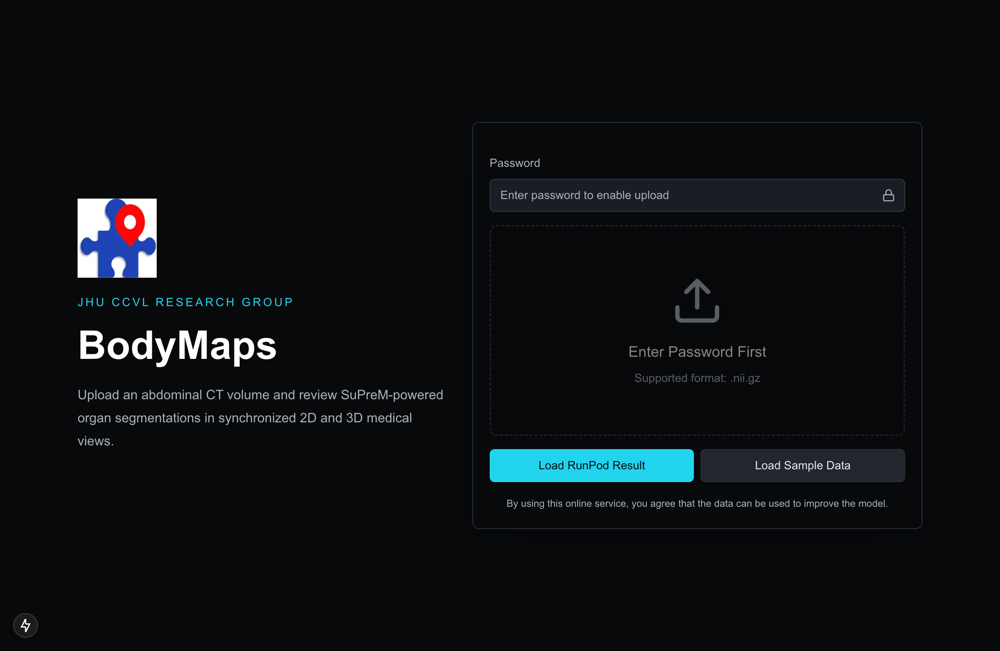
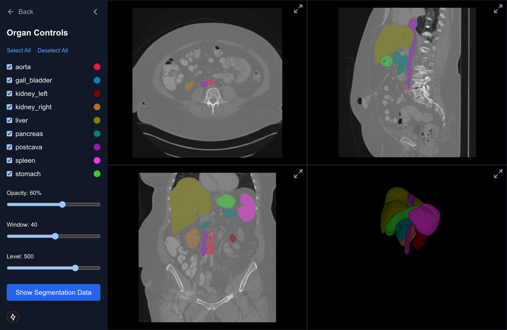
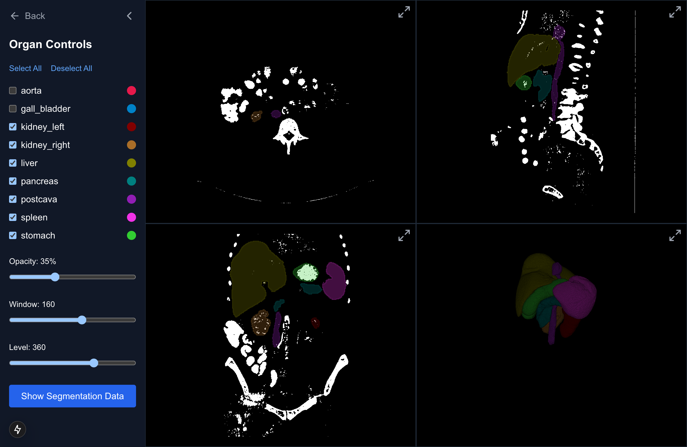
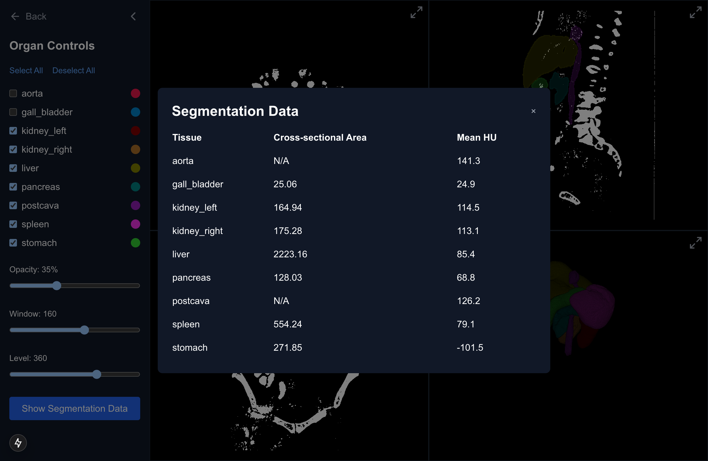

# BodyMaps UI Flow

This page collects app-only screenshots and recordings from a BodyMaps inference review session. The visualized result was produced through the BodyMaps `/api/process` route against a RunPod Serverless endpoint, returning nine SuPreM organ segmentations for a public CT volume.

Raw JSON output and unpacked NIfTI assets are intentionally ignored by Git. They can be regenerated locally from the RunPod response and are not required for the checked-in visual proof.

## Demo

[app demo recording](bodymaps-runpod-visualization.mp4)

## Flow

### 1. Upload CT Volume

The user starts with a focused upload screen for a `.nii.gz` CT volume.

### 2. Review Segmentation Result

After inference, the visualization page opens a four-pane review layout with axial, sagittal, coronal, and 3D views.

### 3. Adjust Viewer Controls

The sidebar controls organ visibility, segmentation opacity, and CT window/level.

### 4. Inspect Measurements

Quantitative segmentation outputs are available in the data modal.

## Additional Captures

| Capture | Description |
| --- | --- |
| `02-runpod-result-loading.png` | Transition into the RunPod-result viewer. |
| `07-axial-fullscreen.png`, `07-axial-scrolled.png` | Axial viewport interactions. |
| `08-sagittal-fullscreen.png`, `08-sagittal-scrolled.png` | Sagittal viewport interactions. |
| `09-coronal-fullscreen.png`, `09-coronal-scrolled.png` | Coronal viewport interactions. |
| `10-3d-fullscreen-before-rotate.png`, `10-3d-rotated-fullscreen.png` | 3D viewport before and after rotation. |
| `11-sidebar-collapsed.png`, `12-sidebar-expanded-final.png` | Sidebar/menu state changes. |
